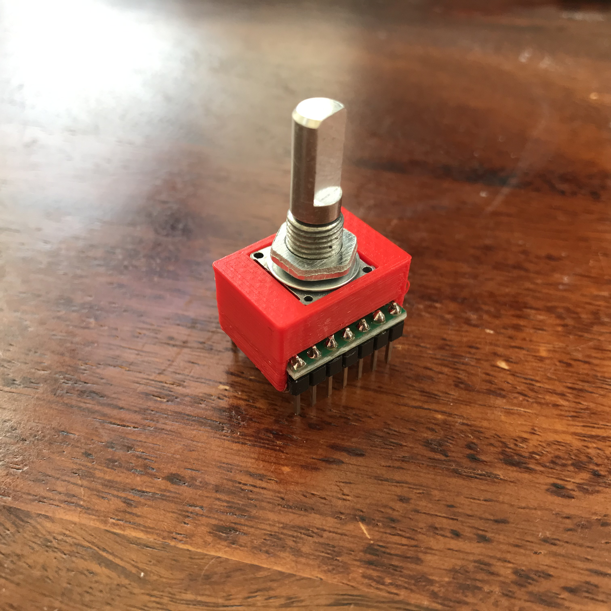

# AS5048A Magnetic Rotary Encoder

This is a simple example of the AS5048A Magnetic Rotary Encoder - the code here is mostly taken from here: [Rob Dobson't Trim Wheel](https://github.com/robdobsn/TrimWheel/blob/master/Software/TrimWheelSWTeensy32/AS5048A.cpp)

I've made a pretty nice component based around this sensor and used it for my asteroids game.

You can watch a video on how it all works [here](https://www.youtube.com/watch?v=1UmqNF65rck)

The actual component looks really nice. I canibalised a mechanical rotary encoder for the parts and made a nice 3D printed enclosure for it:

